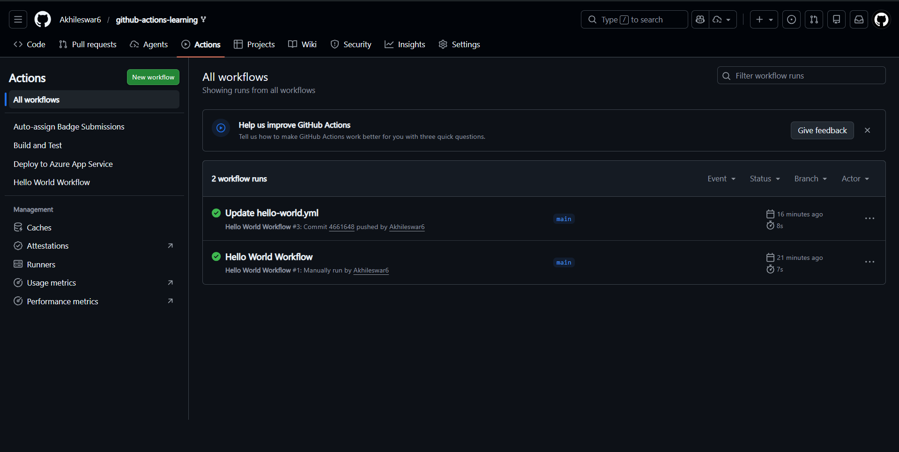

**Task - 1:**
Hello world workflow running✅

**Task - 2:** 
Workflow triggered by push event✅

1. Completion of Hello World workflow
2. Completion of Update Hello world workflow, done through updation -> commit -> push.

**Task - 3** Local tests passing with npm test
